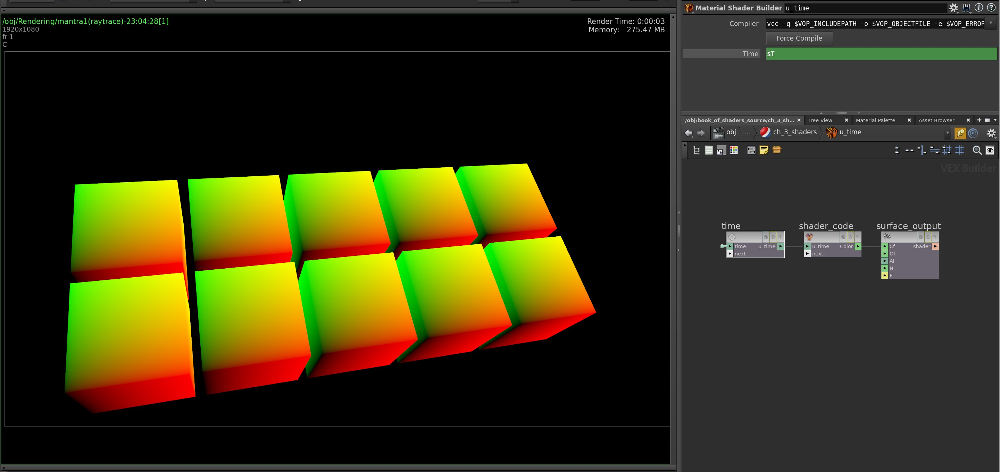
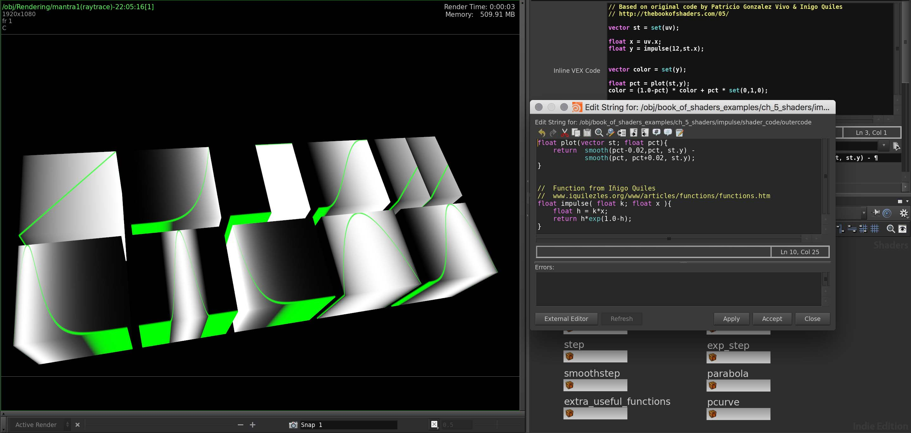

# The Book of Shaders in Houdini Vex

[Patricio Gonzalez Vivo's The Book of Shaders](http://bookofshaders.com) is one of the best resources out there to learn how to code GLSL shaders. I use it extensively to create [ISF shaders in VDMX](https://github.com/JosephFiola/SaturdayShaders).

With the intention of eventually porting my [Saturday Shaders](https://github.com/JosephFiola/SaturdayShaders) project over to [Houdini Vex](https://www.sidefx.com/docs/houdini15.5/vex/_index) I've started to go through the [The Book of Shaders](http://bookofshaders.com) examples in order to learn how.

---
###Chapters completed so far
**Chapter 3 - Uniforms**

While uniforms like gl\_FragCoord aren't really applicable to Vex Shaders, this chapter was handy in figuring out how to get the **u\_time** paramater to work in Vex as well as getting UVs to work (which I'm guessing is pretty much what gl\_FragCoord.xy is). 

**Chapter 5 - Shaping Functions** 

---